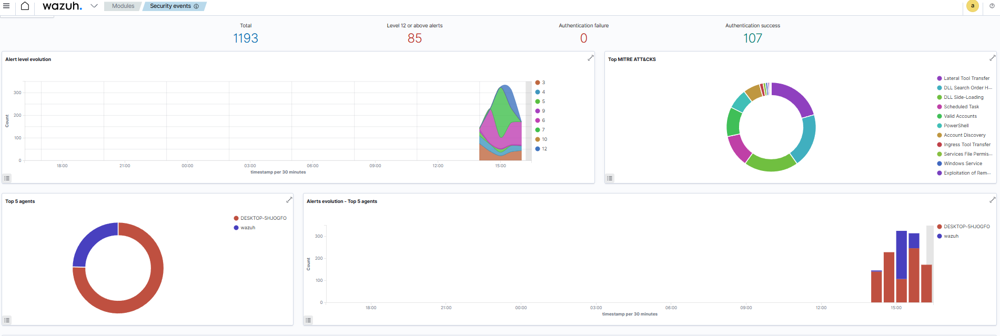
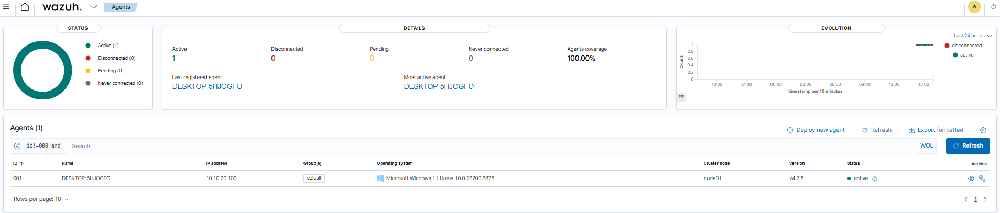
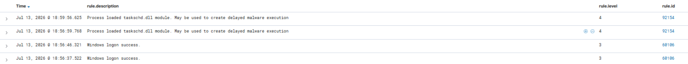
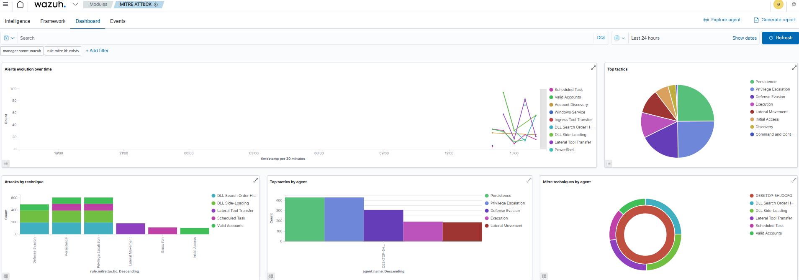

# Wazuh Setup

Wazuh is used as the central monitoring and detection platform of the SOC-LOTL-Lab.

It receives Windows and Sysmon events, applies custom detection rules and displays the resulting alerts in the dashboard.



---

## Role in the Lab

Wazuh provides:

- centralized event collection;
- Windows endpoint monitoring;
- Sysmon event analysis;
- custom LOTL detection rules;
- event correlation;
- MITRE ATT&CK mapping.

The Wazuh server is connected to the SOC VLAN and uses a fixed IP address.

```text
Wazuh IP: <WAZUH_SERVER_IP>
Network: SOC VLAN
```

---

## Required Communications

The Windows workstation must be able to reach the Wazuh server through OPNsense.

| Port | Protocol | Purpose |
|---:|---|---|
| 1514 | TCP | Agent event forwarding |
| 1515 | TCP | Agent enrollment |
| 55000 | TCP | Wazuh API |
| 443 | TCP | Wazuh dashboard |

The OPNsense rules allowing these communications must be placed above the general inter-VLAN blocking rules.

---

## Agent Enrollment

Install the Wazuh agent on the Windows workstation using the deployment command provided by the Wazuh dashboard.

Configure the Wazuh manager address:

```text
<WAZUH_SERVER_IP>
```

Start the agent:

```powershell
Start-Service WazuhSvc
```

Verify its status:

```powershell
Get-Service WazuhSvc
```

The Windows endpoint should then appear as active in the Wazuh dashboard.



---

## Sysmon Event Collection

Sysmon generates detailed Windows endpoint telemetry, including:

- process creation;
- command-line arguments;
- parent processes;
- network connections;
- file creation;
- scheduled task activity.

The Wazuh agent is configured to collect:

```text
Microsoft-Windows-Sysmon/Operational
```

The reusable agent configuration is available here:

[`configs/wazuh/agent.conf`](../configs/wazuh/agent.conf)

After modifying the configuration, restart the agent:

```powershell
Restart-Service WazuhSvc
```

---

## Custom Detection Rules

Custom Wazuh rules detect the different stages of the LOTL scenario.

| Rule ID | Detection |
|---|---|
| `100001` | Payload download using `certutil.exe` |
| `100002` | Headless execution using `conhost.exe` |
| `100003` | Persistence using `schtasks.exe` |
| `100010` | Correlation of the complete attack chain |

The reusable rule file is available here:

[`configs/wazuh/local_rules.xml`](../configs/wazuh/local_rules.xml)

Copy or merge the rules into:

```text
/var/ossec/etc/rules/local_rules.xml
```

Restart the Wazuh manager:

```bash
sudo systemctl restart wazuh-manager
```

Verify its status:

```bash
sudo systemctl status wazuh-manager
```

---

## Rule Testing

The rules can be tested with:

```bash
sudo /var/ossec/bin/wazuh-logtest
```

Representative Sysmon events can be pasted into the tool to verify which Wazuh rule is triggered.

The rule fields may need to be adapted if the received Sysmon events use a different field structure.

---

## Detection Result



Each suspicious action generates a dedicated alert.

The final correlation rule creates a higher-level alert when the download, execution and persistence stages occur within the configured time window.

This provides more context than treating the execution of one legitimate Windows binary as automatically malicious.

---

## MITRE ATT&CK Mapping



The custom rules include MITRE ATT&CK identifiers corresponding to the detected behaviour:

| Behaviour | MITRE ATT&CK |
|---|---|
| Payload transfer | `T1105` |
| Command execution | `T1059` |
| Scheduled task persistence | `T1053.005` |

---

## Validation

Verify that:

- the Windows agent appears as active;
- Sysmon events reach Wazuh;
- process command lines are visible;
- the custom rules load without XML errors;
- the three attack stages generate alerts;
- the final correlation alert is generated.

Useful Wazuh manager logs:

```bash
sudo tail -f /var/ossec/logs/ossec.log
```

Alerts can be monitored with:

```bash
sudo tail -f /var/ossec/logs/alerts/alerts.json
```

---

## Next Step

Continue with the Windows endpoint configuration:

[Windows Setup](windows.md)
